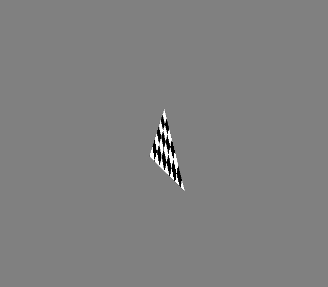

# Computer Graphics from scratch

Welcome, this series is about my journey on writing software renderer from scratch in C on CPU. I will write more as I make progress with this project. The goal of this it to learn and understand what goes behind rendering API like Metal/DX/Vulkan/etc. and so that I can understand applied computer graphics from all layers of abstractions.

## Rendering First Image

For now, I will just output a [PPM](https://en.wikipedia.org/wiki/Netpbm) file, because it the easiest one to read/write from/to.

so, now we just create a test image, to ensure that pixel writing works:


```c
FILE* file_ptr = fopen("render.ppm", "w");
assert(file_ptr != NULL);

vec3_T frame_buffer[WIDTH * HEIGHT] = {};

for (int y = 0; y < HEIGHT; ++y){
    for (int x = 0; x < WIDTH; ++x){
        frame_buffer[y * WIDTH + x].x = (unsigned char)((float)x/WIDTH*255.0);
        frame_buffer[y * WIDTH + x].y = (unsigned char)((float)y/HEIGHT*255);
        frame_buffer[y * WIDTH + x].z = (unsigned char)(255);
    }
}

fprintf(file_ptr, "P3\n %d %d \n255\n", WIDTH, HEIGHT);
for (int i = 0; i < WIDTH*HEIGHT; ++i){
    vec3_T col = frame_buffer[i];
    fprintf(file_ptr, "%d %d %d\n", (int) col.x, (int) col.y, (int) col.z);
}
fclose(file_ptr);
```

*NOTE: code here is just to demonstrate the concept*

you should get something like this:


## Filled Triangle

Let say we have 3 points A, B and C, these points are triangle's vertices. We check if a point P is inside the triangle or outside it, if it inside than we color a pixel at point P. To check, we take cross product of P and any other vertices joining at a common vertex.

That is:
```txt
-> Area = (P - A) x (B - A)

          | Px - Ax   Bx - Ax |
-> Area = |                   |
          | Py - Ay   By - Ay |

-> Area = (Px - Ax)(By - Ay) - (Py - Ay)(Bx - Ax)

(Note: order matters!)
```

What we care about is sign of area, but not it's values (for now). The line joining the products (P - A) and (B - A), will split apart the plane into two, one will be called 'right' (area is +ve) and another 'left' (area is -ve). Now, we will take cross product the same way with all sides and then at some point P, the result of three cross product is either -ve or +ve, we know the point is either inside or outside the triangle. How the vertices are taken as A, B or C, matters, that is their 'winding order'. And this winding order decides if point is inside when all cross products are +ve or -ve.

For example:

```txt
-> I = (0.0, 0.5)
-> J = (0.5, -0.5)
-> K = (-0.5, -0.5)
```

And we get their cross-product as:

```txt
-> Area1 = (P - I) x (J - I) // A = I, B = J
-> Area2 = (P - J) x (K - J) // A = J, B = K
-> Area3 = (P - K) x (I - K) // A = K, B = I
```

Our winding order here is 'counter-clock-wise' and so, point is inside the triangle if all areas is -ve.

```c
if(Area1 < 0 && Area2 < 0 && Area3 < 0){
    printf("point is inside!");
}
```

If winding order was 'clock-wise' then point would be in triangle is all areas were +ve.

```c
float edge_function(float ax, float ay, float bx, float by, float px, float py){
    return (px - ax) * (by - ay) - (py - ay) * (bx - ax);
}
```
```c
for (int y = 0; y < HEIGHT; ++y){
    for (int x = 0; x < WIDTH; ++x){

        float w0 = edge_function(x0, y0, x1, y1, x, y);
        float w1 = edge_function(x1, y1, x2, y2, x, y);
        float w2 = edge_function(x2, y2, x0, y0, x, y);

        if(w0 < 0 && w1 < 0 && w2 < 0){
            put_pixel(frame_buffer, x, y, 255, 0, 0);
        }
    }
}
```

We should get:


