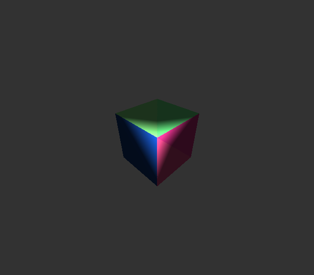
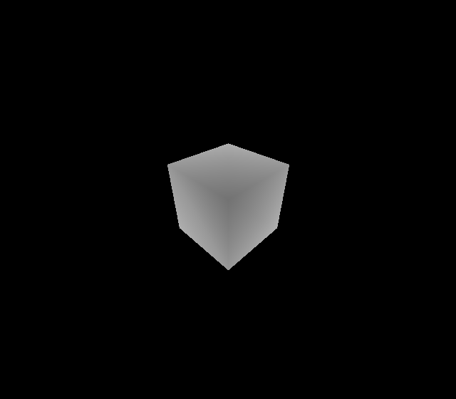
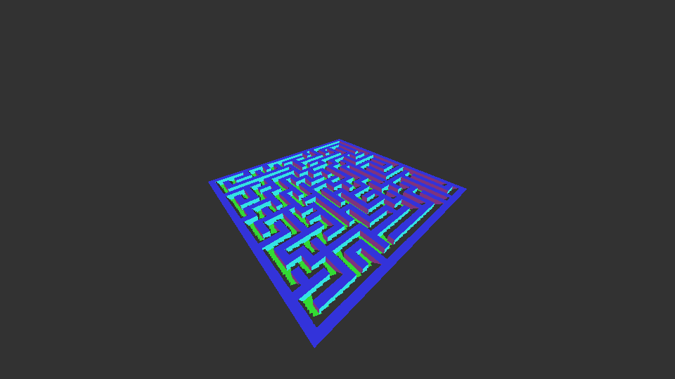

# Computer Graphics from scratch

> Any sufficiently advanced technology is indistinguishable from magic - Arthur C. Clarke

I have been doing computer graphics for quite some time, so I am not a **total** beginner at it. The main problem was that I skipped some theoretical parts and didn't try to understand them (admittedly, mathematics). Instead, I jumped here and there to produce pretty-looking renders. So I decided to start computer graphics from scratch, where the goal is to try to learn and understand as much as possible. So, I thought writing a CPU rasterizer was a way to achieve it. As it will help me learn and understand: 

- How APIs like OpenGL, Metal, etc works underneath.
- How to structure/architect renderer properly, so that it efficient.
- What kind of mathematics are generally used in computer graphics. And give motivation to learn vectors and matrices.
- Basics optimizations techniques such as AABB, frustrum culling, etc and also advanced techinques suchs as Multithreading and SIMD.

And the last (but not least) reason is [this](https://justforfunnoreally.dev).

I chose C for this project mainly because C/C++ is required for computer graphics jobs. Though, I plan to switch to Zig when I am done with enough C projects.

> The reason I chose C instead of C++. Because of C's simplicity and doesn't have the same type of C++'s "modern" bullshit.

Before we go any further, I would like to say that [scratchapixel](https://www.scratchapixel.com) is one of the best sites I have found on computer graphics.

## Triangle
The first step is pretty obvious to anyone that has done even a bit of computer graphics. And that is to produce `Hello Triangle`.

Then we take a step further and add camera and perspective projection. We use a checkerboard pattern to see if the perspective interpolation of UVs is correct. (It might look incorrect, but if you squint your eye, you will see it. I am too lazy to go back and get a better render XD)

## More than a Triangle
How about 12 triangles? We put them together to get a cube. Added depth-testing and lighting. Here is the cube with normal as colour and its depth map.

## Geometry primitives are boring
I wanted to learn procedural generation for quite some time now. But it would take some time to produce anything cool, so I decided to copy-paste the maze generation code that I wrote before and create a mesh from it. (The maze generator I used here is backtracker)

## Shadows
I was going to jump to do some optimization, but scratchapixel's owner told me to add shadows. Fortunately, I implemented shadow mapping before when I used to write GPU renderer, so I knew what to do. Also quickly pushed it to have vertex colours.

## Optimizations
When I benchmarked with `hyperfine` it showed that it takes (no compiler optimizations):

| Timing (Range)      | AABB |
| ------------------- | ---- |
| 58.598 s … 58.814 s | No   |
| 503.9 ms … 545.4 ms | Yes  |

I thought I need to implement multithreading and SIMD to make it interactive and that the CPU software rasterizer was terribly slow. But I did a stupid mistake and included all the `fprintf` for ppm in the calculation. After removing them, I got (with AABB, without AABB is terribly slow):

| Timing (Range)      | Compiler Optimization |
| ------------------- | --------------------- |
| 33.9 ms ... 36.4 ms | None                  |
| 6.6 ms …   8.4 ms   | O2/O3                 |

It's hard to see how good is CPU at rasterizing, even then it looks a lot better right now. Though our maze is far away, AABB would slow down a lot when we get close to the maze, since it will have to calculate lot more pixels.

We will have to implement multi-threading, SIMD  and other techniques such as frustum culling, to at least make it interactive for a close-up low-poly scene.

I am using 2015 MacBook Pro with `2.2 GHz Quad-Core Intel Core i7` to measue this.

See ya'all in later :)